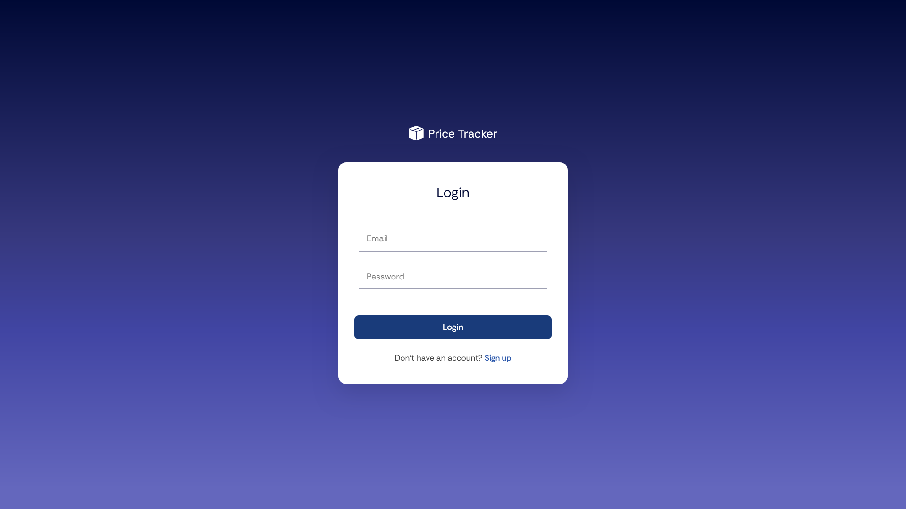
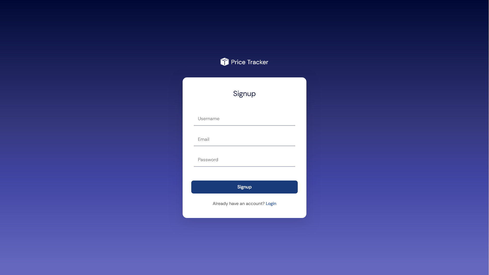
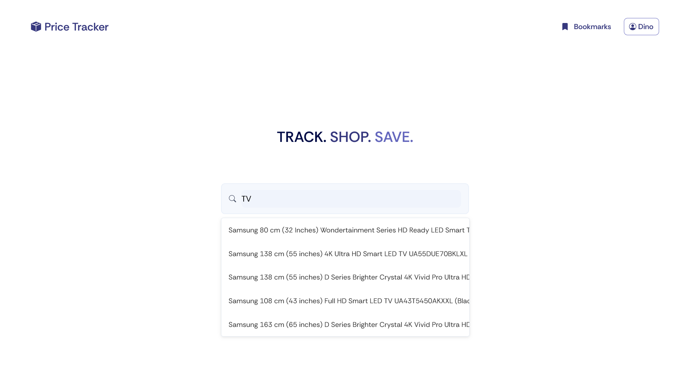
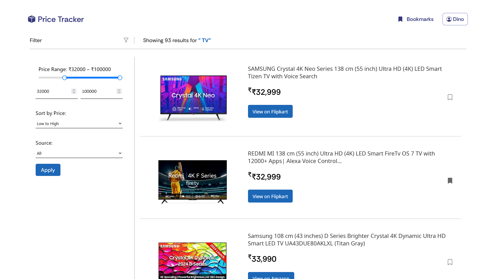
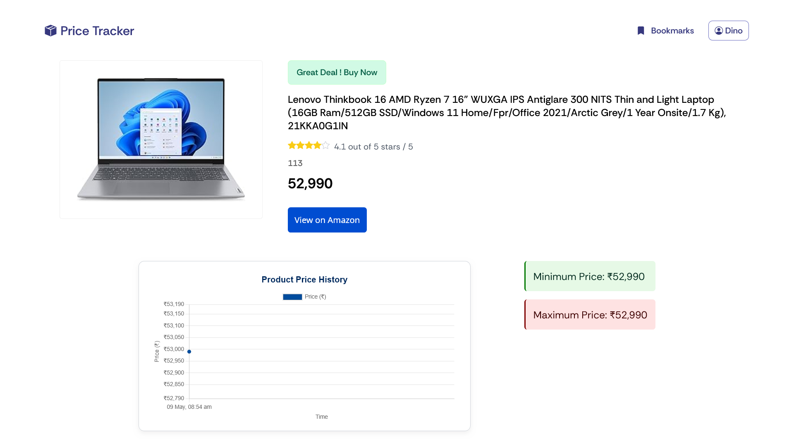
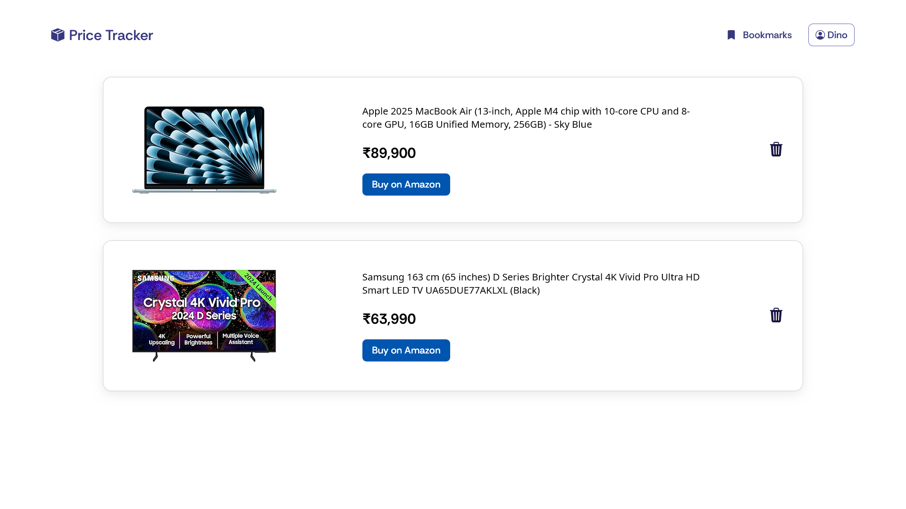
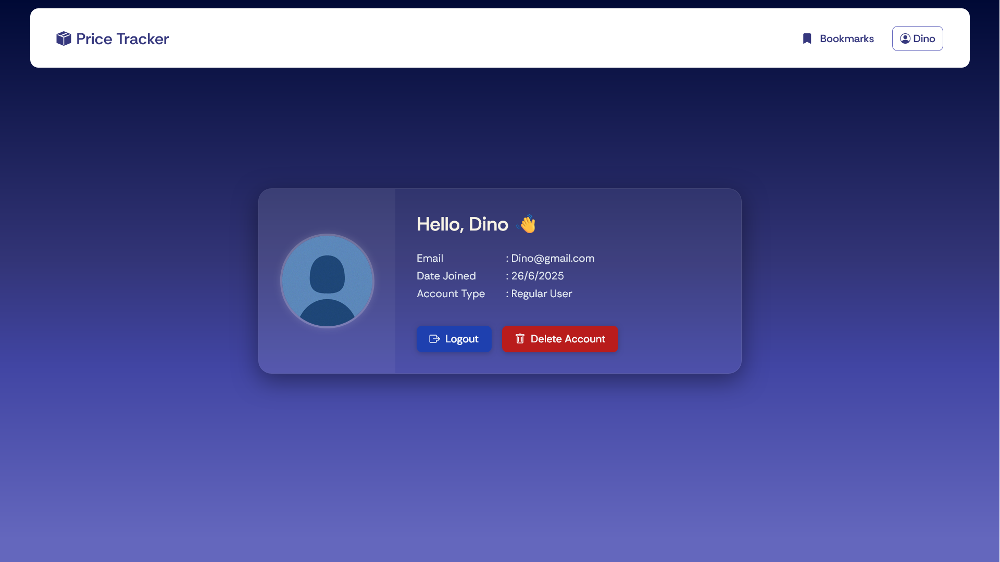

# Price Tracker 

## Real-Time Product Monitoring Web App

A web-based application to track prices across multiple e-commerce platforms, save your wishlist, and get the best deals — all in one place!

### Features

- 🔍 **Search Products** – Search and view product details from major e-commerce platforms.
- 💸 **Real-Time Price Updates** – Automated daily scraping keeps prices fresh.
- 💾 **Wishlist Support** – Bookmark products and track them over time.
- 📉 **Price Trend Charts** – Visualize product price history.
- 🔒 **Secure Login** – JWT-based authentication for personalized experience.
  

### Technologies

### Login | Register

  
   

### Home Page

### Search Page

### Product Analysis

### Bookmarks 

### User Profile

